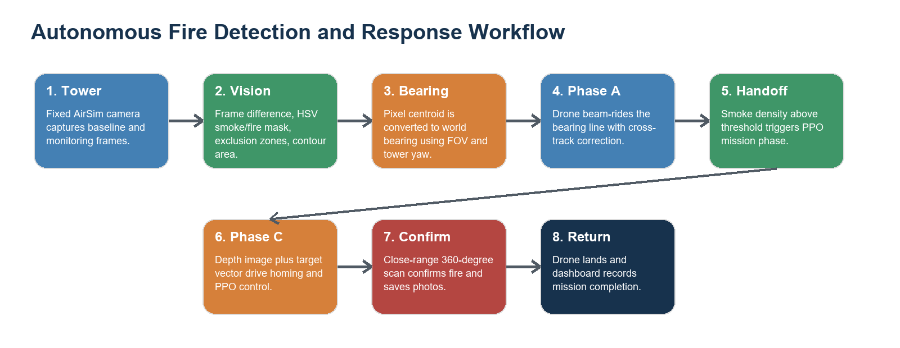
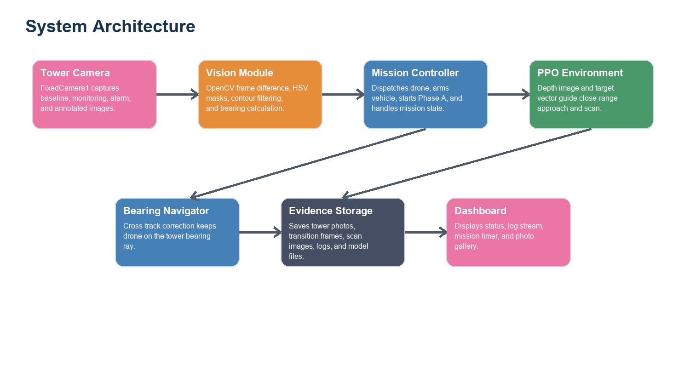

# Autonomous Flight Sentinel: Fire Detection and Autonomous Drone Response in AirSim

Prepared by: [Student Name Surname]

Supervisor: [Dr. Name Surname]

Date: 11 May 2026

## Abstract

This report presents an autonomous flight simulation project for detecting forest fire or smoke from a fixed observation tower and dispatching a multirotor drone to verify the source. The system uses AirSim with an Unreal Engine environment, OpenCV-based image processing, bearing-based navigation, and a reinforcement learning mission phase based on Proximal Policy Optimization (PPO). In the recorded experiment, the tower camera monitored the scene every 5 seconds, detected a smoke/fire change region with an area of 50,742 pixels, calculated a bearing of 207.38 degrees, and dispatched the drone. The drone followed the bearing, detected smoke at 20.09 percent image density on step 10, then entered the PPO-based close-approach and confirmation phase. A 360-degree scan confirmed the fire at a distance of 4.3 m and saved directional evidence photos. The result shows that a modular vision-navigation-RL pipeline can detect, approach, and confirm a simulated fire event autonomously.

## Introduction

Early forest fire detection is time critical because small fires can grow rapidly under wind, dry vegetation, and difficult terrain conditions, while climate and land-use changes are increasing the risk of extreme wildfire events [1]. Fixed optical camera systems are widely studied for early warning because they can continuously observe high-risk areas from watchtowers or other high vantage points [2,3]. However, fixed cameras cannot physically inspect a smoke source. Drones can provide close-range confirmation and flexible aerial observation, but they need a reliable dispatch direction and a navigation strategy that handles terrain, trees, smoke, and uncertain visual conditions [5,6].

The project addresses this problem in simulation. AirSim provides a physics-aware multirotor interface, camera streams, depth images, collision information, and object pose queries inside an Unreal Engine scene. The implemented system combines a fixed tower camera for detection, a bearing-based flight controller for long-range approach, and a PPO-based phase for close navigation and fire confirmation. A dashboard records mission state, log messages, and saved images.

The work is useful as a prototype for autonomous emergency response research because the main perception and control modules can be tested repeatedly in a safe simulated environment before any real-world deployment. Simulation also allows controlled placement of fire actors, trees, and map boundaries.

**Figure 1.** Overall workflow of the implemented autonomous fire detection and response system.

## Purpose of the Study

The purpose of this study is to design and evaluate an autonomous drone response pipeline that can:

1. Monitor a forest scene using a fixed tower camera.
2. Detect a new smoke or fire event using image processing.
3. Estimate a world bearing from the detected camera pixel location.
4. Dispatch a drone and guide it toward the likely fire region.
5. Use close-range visual evidence and PPO-based control to confirm the fire.
6. Save mission logs, photos, and dashboard outputs for later analysis.

The project is not intended as a final real-world fire response system. It is a simulation-based proof of concept that demonstrates integration between perception, flight control, reinforcement learning, and reporting.

## Theoretical Review

### AirSim and simulated autonomous flight

AirSim is a high-fidelity simulation platform for autonomous vehicles. It supports multirotor control, camera sensors, depth images, collision checks, and physics-based vehicle movement in Unreal Engine scenes [8]. In this project, AirSim is used as the experimental environment because it allows autonomous flight code to interact with a realistic 3D forest scene without risking physical hardware. Simulation is also common in UAV wildfire research because it allows large-area monitoring and control strategies to be tested repeatably before field deployment [7].

### Computer vision for smoke and fire detection

The tower detection stage uses a background-change method. A baseline image is captured from the fixed camera. Later frames are compared with the previous clear frame after grayscale conversion and Gaussian blur. Pixel differences above a threshold are combined with HSV color masks for smoke and fire. Optical fire-detection studies commonly use visible-spectrum color, motion, spatial, and temporal cues, but single-feature color methods can suffer from false alarms in complex outdoor scenes [3,4]. Static exclusion zones therefore remove regions such as water reflections that could otherwise cause false alarms.

The detection mask can be summarized as:

`M = (abs(blur(gray(I_t)) - blur(gray(I_ref))) > threshold) AND HSV_smoke_fire(I_t) AND not_excluded`

An alarm is triggered only when the final contour area exceeds a minimum threshold for a required number of consecutive frames. This improves robustness because random reflections or one-frame noise are less likely to dispatch the drone.

### Bearing estimation

After the largest change contour is found, its centroid pixel is converted to a bearing. The formula used by the tower module is:

`bearing = (tower_yaw + ((pixel_x / image_width) - 0.5) * camera_fov) mod 360`

For the recorded run, the detected centroid was at pixel `(598, 397)` in a 1920 x 1080 frame. With a 120 degree camera field of view and a tower yaw of 230 degrees, the system calculated a target bearing of 207.38 degrees.

### Bearing navigation and cross-track correction

The bearing navigation phase moves the drone along the tower ray rather than simply flying in an approximate compass direction. The controller forms a ray direction from the bearing and calculates cross-track error to keep the drone close to that line. The velocity command combines forward motion with a lateral correction term. This is important because a drone starting away from the tower ray could otherwise drift parallel to the desired path.

### Reinforcement learning and PPO

The close-range navigation phase is modeled as a reinforcement learning task. PPO is a policy-gradient algorithm that alternates between sampling trajectories from the environment and optimizing a clipped surrogate objective [9]. The implementation uses Stable-Baselines3 for PPO training and inference utilities [10]. The custom environment follows a Gymnasium-style API and provides observations, actions, rewards, and termination conditions [11].

The project observation space includes an 84 x 84 depth image and a 2D target direction vector. The continuous action space contains forward velocity, lateral velocity, and yaw rate. The reward encourages progress toward the fire, penalizes collisions, applies a small time cost, and gives a large positive reward when fire is confirmed.

## Experimental Setup

### System architecture

The system was organized as separate modules so that tower detection, drone navigation, reinforcement learning, evidence collection, and dashboard visualization could be developed and tested independently. This modular design also makes it easier to replace one part later, for example changing the HSV smoke detector to a deep learning detector without rewriting the drone controller.

**Figure 2.** System architecture of the autonomous fire detection and response project.

### Software and hardware environment

The experiment was run in the local project workspace with the following main components:

| Component | Role in the project |
|---|---|
| AirSim | Drone simulation, camera streams, movement commands, collision information |
| Unreal Engine scene | Forest, terrain, trees, smoke/fire actor, fixed tower camera |
| OpenCV [12] | Frame differencing, HSV thresholding, contour detection, annotated images |
| NumPy | Image arrays, vector calculations, numerical operations |
| Stable-Baselines3 and PyTorch | PPO model creation and training |
| Gymnasium | Custom reinforcement learning environment interface |
| Dashboard server | Local mission dashboard, log watcher, photo gallery, state display |

The run command sequence used by the project is documented in `runningorder.txt`: start the dashboard server, then run the AI tower monitor script. The dashboard serves mission status at `http://localhost:8765`.

**Figure 3.** Placeholder for dashboard screenshot. Replace this image with the real dashboard view showing mission status, logs, and saved photos.

### Mission pipeline

The implemented project contains multiple mission modules. The current recorded run used the following chain:

1. `ai_tower_monitor.py` connects to AirSim and captures tower images.
2. `compare_frames()` detects changed smoke/fire-like regions.
3. `calculate_bearing()` converts the detection pixel into a bearing.
4. `dispatch_drone()` resets, arms, and launches the multirotor.
5. `BearingNavigator` follows the tower bearing and checks smoke density.
6. When smoke density exceeds the threshold, the system starts PPO on-site training.
7. `AirSimFireEnv` guides close approach, performs a 360-degree scan, and confirms fire.
8. The system saves mission photos, saves the model, lands, and updates the dashboard.

The repository also contains a `PlumeTracker` module for a mid-altitude smoke-gradient phase. However, the recorded mission used the newer direct handoff from bearing navigation to PPO after smoke detection.

### Experimental procedure

The experiment followed a repeatable procedure:

1. Start the AirSim/Unreal Engine scene and make sure the forest, fire actor, tower camera, and drone are available.
2. Start the dashboard server so mission logs and photos can be displayed.
3. Start the AI tower monitor script and capture a clear baseline image from the fixed camera.
4. Allow the fire/smoke source to appear in the scene.
5. Compare each new tower frame with the clear reference frame.
6. Trigger an alarm only after the changed smoke/fire region exceeds the area threshold for consecutive frames.
7. Calculate the target bearing from the detected contour centroid.
8. Reset, arm, and launch the drone.
9. Fly the drone along the tower bearing while checking front-camera smoke density.
10. Hand off to the PPO-based close-range phase when smoke density is high enough.
11. Perform close-range 360-degree scan images near the fire.
12. Confirm fire, save evidence photos, save the PPO model, land the drone, and review the dashboard output.

### Key configuration values

| Parameter | Value used in the project | Purpose |
|---|---:|---|
| Tower capture interval | 5 s | Time between monitoring frames |
| Frame difference threshold | 25 | Minimum grayscale change per pixel |
| Alarm area threshold | 2,000 px | Minimum contour area for alarm |
| Required consecutive detections | 2 | Reduces one-frame false positives |
| Tower camera FOV | 120 deg | Converts pixel offset to angular offset |
| Tower yaw | 230 deg | Converts camera-relative angle to world bearing |
| Phase A cruise altitude | about 5 m AGL | Long-range bearing navigation altitude |
| Phase A cruise speed | 6 m/s | Approach speed toward target bearing |
| Smoke density handoff threshold | 15 percent | Starts close-range PPO phase |
| PPO depth image size | 84 x 84 | Compact visual observation |
| Fire scan trigger distance | 5 m | Starts 360-degree confirmation photos |
| Fire proximity confirmation | 2 m | Confirms when the drone is very close |

## Results and Discussion

### Tower detection result

The tower camera captured a baseline frame and monitored the scene every 5 seconds. The first two frames were clear or below threshold. Frame 3 produced the first detection hit with 3,921.5 changed pixels, and frame 4 produced the second consecutive hit with 50,742 changed pixels. The final alarm frame was saved with an outline, centroid, bearing, timestamp, and area label.

**Figure 4.** Tower alarm output. The system detected the smoke/fire region, marked the centroid, and calculated a bearing of 207.4 degrees.

### Drone approach result

After the alarm, the system detected the fire actor in the AirSim scene at approximately `(-238.20, 24.20) m`. The drone took off and entered Phase A. At step 10, the drone position was approximately `(-50.2, -26.0) m`; smoke density reached 20.09 percent, exceeding the 15 percent handoff threshold.

**Figure 5.** Placeholder for drone flying toward the fire. Replace this image with your real in-flight drone screenshot.

**Figure 6.** Drone camera frame saved when bearing navigation transitioned into close-range PPO training.

### Close-range confirmation result

The PPO phase used the known fire position, depth images, target direction, homing behavior, and close-range scanning. When the drone reached the scan radius, it captured five confirmation images: north, east, south, west, and downward. Fire-colored pixels were detected in all five scans.

**Figure 7.** Confirmation scan photos saved by the mission phase.

| Scan direction | Fire-colored pixels detected |
|---|---:|
| North | 3,801 |
| East | 5,803 |
| South | 7,086 |
| West | 2,913 |
| Downward | 5,756 |

The mission confirmed the fire at 4.3 m using the scan method. PPO training stopped after confirmation, the model was saved as `ppo_forest_final.zip`, and the drone landed safely. From the tower alarm at 18:44:57 to landing at 18:50:43, the response and confirmation sequence took about 5 minutes and 46 seconds.

### Performance evaluation summary

The following table summarizes the most important performance indicators from the recorded mission. These values are useful because they connect the visual evidence to measurable system behavior.

| Metric | Recorded value | Interpretation |
|---|---:|---|
| Tower image resolution | 1920 x 1080 | High enough to localize the smoke/fire region from the tower |
| Monitoring interval | 5 s | Detection was checked periodically instead of continuously |
| Alarm confirmation frame | Frame 4 | The system avoided dispatching on the first weak change |
| First detection hit | 3,921.5 changed pixels | Above the 2,000 px threshold, but not yet confirmed |
| Confirmed alarm area | 50,742 changed pixels | Strong smoke/fire evidence in the tower image |
| Calculated bearing | 207.38 deg | Bearing used for drone dispatch |
| Fire actor position | (-238.20, 24.20) m | Ground-truth AirSim fire location detected from scene object |
| Smoke density at handoff | 20.09 percent | Above the 15 percent handoff threshold |
| PPO scan distance | 4.3 m | Fire confirmed within close-range scan distance |
| Alarm-to-landing duration | about 5 min 46 s | Total response and confirmation time for the recorded mission |

### Mission timeline

| Time | Event | Evidence |
|---|---|---|
| 18:44:36 | Baseline captured | 1920 x 1080 tower image |
| 18:44:52 | First alarm hit | 3,921.5 changed pixels |
| 18:44:57 | Alarm confirmed | 50,742 changed pixels, bearing 207.38 deg |
| 18:44:58 | Drone dispatched | Fire actor detected at (-238.20, 24.20) m |
| 18:45:03 | Phase A started | Cruise speed 6 m/s, altitude about 5 m AGL |
| 18:45:16 | Smoke handoff | 20.09 percent smoke density at step 10 |
| 18:45:23 | PPO phase started | On-site training and close-range navigation |
| 18:50:23 | Fire confirmed | 4.3 m distance, 360-degree scan |
| 18:50:43 | Mission complete | Drone landed safely |

### Discussion

The experiment demonstrates that the modular pipeline can move from distant detection to close confirmation without manual flight control. This matches the direction of recent wildfire-monitoring research, where fixed sensing, airborne sensing, and autonomous UAV control are often combined to reduce response time and improve safety [3,5,6]. The tower camera provides a wide-area trigger, bearing navigation gives the drone a practical long-range direction, and the close-range PPO stage handles the final approach and confirmation.

The main strength of the approach is integration: camera monitoring, geometric bearing conversion, flight commands, reinforcement learning, mission logging, and dashboard visualization all work together. The saved alarm frame and scan images also make the mission auditable.

The main limitation is that the evidence comes from a single recorded simulation run. HSV thresholds and exclusion zones are tuned to the current scene, so additional scenes, weather, lighting conditions, and smoke colors should be tested. The AirSim environment also does not fully represent real wind, sensor noise, communication delay, battery limits, or flight regulations. For real deployment, the perception method would need stronger validation, and the navigation stack would need hardware safety layers.

## Limitations

Although the project successfully completed the recorded simulation mission, several limitations should be considered:

1. The experiment was performed in simulation, so real drone issues such as wind, GPS drift, battery limits, communication delay, and camera vibration were not fully represented.
2. The tower detector uses tuned HSV ranges and manually defined exclusion zones. These settings may need adjustment for different lighting, terrain, water reflections, or smoke colors.
3. The result is based on one recorded mission. More trials with different fire locations and environmental conditions are needed before making strong performance claims.
4. The fire actor position was available through the AirSim scene API during the mission chain. A real system would not have direct access to this ground-truth object position.
5. The close-range PPO phase was tested in the simulation environment only. Transfer to a real drone would require safety checks, hardware constraints, and additional validation.
6. The system confirms the fire visually, but it does not estimate fire size, spreading speed, temperature, or risk category.
7. The dashboard is useful for monitoring, but it is not yet a full emergency-response interface with operator decisions, map overlays, or alert history.

## Future Work

Future development can improve both scientific value and practical realism:

1. Run repeated experiments with multiple random fire locations and compare detection time, bearing error, flight time, and confirmation success rate.
2. Replace or support HSV thresholding with a trained smoke/fire detection model to improve robustness under different lighting and weather conditions.
3. Compare classical computer vision detection with deep learning detection on the same saved tower frames.
4. Add simulated wind, sensor noise, delayed communication, and battery limits to make the mission closer to real drone operation.
5. Add a map-based dashboard view that shows tower position, drone trajectory, detected bearing, estimated fire location, and confirmed fire point.
6. Evaluate multi-drone response, where one drone confirms the fire while another maps the surrounding area.
7. Add automatic report generation after every mission, including screenshots, flight path, detection metrics, and confirmation photos.
8. Test the system in different Unreal Engine maps with varied tree density, mountains, rivers, clouds, and lighting.
9. Improve the close-range policy with obstacle-aware path planning and compare PPO with other control or reinforcement learning methods.
10. Prepare a hardware transition plan for a real UAV, including camera calibration, flight safety, legal constraints, and emergency landing behavior.

## Conclusion

The autonomous flight simulation project successfully detected a simulated smoke/fire event, calculated a dispatch bearing, launched a drone, navigated toward the source, performed close-range confirmation, and landed after mission completion. The recorded run produced concrete evidence through annotated tower imagery, drone camera frames, 360-degree scan photos, mission logs, and a saved PPO model. The project is a strong simulation prototype for autonomous wildfire monitoring and response, with future work focused on broader testing, improved perception robustness, and transfer from simulation to real-world operation.

## References

[1] United Nations Environment Programme and GRID-Arendal. (2022). *Spreading like Wildfire: The Rising Threat of Extraordinary Landscape Fires*. https://wedocs.unep.org/handle/20.500.11822/38372

[2] Alkhatib, A. A. A. (2014). *A Review on Forest Fire Detection Techniques*. International Journal of Distributed Sensor Networks, 2014, Article ID 597368. https://doi.org/10.1155/2014/597368

[3] Barmpoutis, P., Papaioannou, P., Dimitropoulos, K., & Grammalidis, N. (2020). *A Review on Early Forest Fire Detection Systems Using Optical Remote Sensing*. Sensors, 20(22), 6442. https://doi.org/10.3390/s20226442

[4] Chaturvedi, S., Khanna, P., & Ojha, A. (2022). *A survey on vision-based outdoor smoke detection techniques for environmental safety*. ISPRS Journal of Photogrammetry and Remote Sensing, 185, 158-187. https://doi.org/10.1016/j.isprsjprs.2022.01.013

[5] Yuan, C., Zhang, Y., & Liu, Z. (2015). *A survey on technologies for automatic forest fire monitoring, detection, and fighting using unmanned aerial vehicles and remote sensing techniques*. Canadian Journal of Forest Research, 45(7), 783-792. https://doi.org/10.1139/cjfr-2014-0347

[6] Bouguettaya, A., Zarzour, H., Taberkit, A. M., & Kechida, A. (2022). *A review on early wildfire detection from unmanned aerial vehicles using deep learning-based computer vision algorithms*. Signal Processing, 190, 108309. https://doi.org/10.1016/j.sigpro.2021.108309

[7] Tzoumas, G., Pitonakova, L., Salinas, L., Scales, C., Richardson, T., Arvin, F., & Hauert, S. (2023). *Wildfire detection in large-scale environments using force-based control for swarms of UAVs*. Swarm Intelligence, 17, 89-115. https://doi.org/10.1007/s11721-022-00218-9

[8] Shah, S., Dey, D., Lovett, C., & Kapoor, A. (2017). *AirSim: High-Fidelity Visual and Physical Simulation for Autonomous Vehicles*. Field and Service Robotics, 621-635. https://doi.org/10.1007/978-3-319-67361-5_40

[9] Schulman, J., Wolski, F., Dhariwal, P., Radford, A., & Klimov, O. (2017). *Proximal Policy Optimization Algorithms*. arXiv:1707.06347. https://doi.org/10.48550/arXiv.1707.06347

[10] Raffin, A., Hill, A., Gleave, A., Kanervisto, A., Ernestus, M., & Dormann, N. (2021). *Stable-Baselines3: Reliable Reinforcement Learning Implementations*. Journal of Machine Learning Research, 22(268), 1-8. https://jmlr.org/papers/v22/20-1364.html

[11] Towers, M., Kwiatkowski, A., Terry, J., Balis, J. U., De Cola, G., Deleu, T., Goulão, M., Kallinteris, A., Krimmel, M., KG, A., et al. (2024). *Gymnasium: A Standard Interface for Reinforcement Learning Environments*. arXiv:2407.17032. https://arxiv.org/abs/2407.17032

[12] Bradski, G. (2000). *The OpenCV Library*. Dr. Dobb's Journal of Software Tools. OpenCV project information: https://opencv.org/about/
