# Autonomous UAV Navigation for Early Forest Fire Detection and Confirmation

Course: CENG401 - Computer Engineering Design

Author: Batuhan Turkaslan (210401052)

Supervisor: Asst. Prof. Dr. Mansur Alp Tocoglu

Date: 14 May 2026

## Abstract

Forest fires pose a devastating threat to ecosystems, property, and human life [1]. A critical limitation of existing fire detection systems, such as satellites and high-altitude unmanned aerial vehicles (UAVs), is their inability to detect fires until smoke rises above the forest canopy, often resulting in delayed intervention when the fire has already grown to a dangerous scale [5, 25]. Early optical remote sensing systems and smoke-detection techniques have also been studied extensively, yet they still rely on above-canopy visibility [3, 4].

This project proposes a novel autonomous drone system designed to operate beneath the forest canopy, confirming fires at their earliest and most manageable stage. It presents an autonomous UAV simulation system that combines a fixed AI tower camera, classical computer vision, bearing-based UAV dispatch, close-range Deep Reinforcement Learning (DRL) navigation, and a web dashboard. The main idea is that the system should not assume a complete forest map or an exact fire coordinate at the start of the mission. Instead, a fixed camera detects a suspicious smoke/fire region and dispatches the UAV toward the suspected bearing. The core challenge of navigating within this dense and GPS-degraded environment is addressed through DRL [9, 10], utilizing a Proximal Policy Optimization (PPO) agent [9] trained in a realistic Unreal Engine simulation to autonomously avoid obstacles and approach the fire. The recorded simulation mission successfully detected a 50,742-pixel smoke/fire change region, calculated a 207.38 degree bearing, handed off after 20.09 percent smoke density, and confirmed fire at 4.3 m using close-range scan images.

## 1. Introduction

        This report is prepared to explain the scope, objectives, and methodology of the thesis/project study planned within the scope of the term project. In this report, the research problem, justification, requirements, modeling approach, and the technologies to be used will be presented from a holistic perspective.

        Wildfires pose a catastrophic threat to ecosystems, property, and human life worldwide, causing severe ecological damage and significant economic losses [1, 2]. A critical limitation of existing forest fire detection systems, such as satellites and high-altitude unmanned aerial vehicles (UAVs), is their inability to detect fires until smoke rises above the forest canopy. This constraint often leads to delayed intervention, at which point fires may have already reached an uncontrollable scale [25]. Deep-learning-based UAV approaches and swarm systems have been explored to close this gap, but they still predominantly operate above the canopy [6, 7]. 

        To address this limitation, this thesis proposes a novel autonomous UAV system designed to operate under the forest canopy, enabling the confirmation of fires at their earliest and most manageable stage. Navigating such dense and cluttered environments presents a significant technical challenge, particularly due to unreliable or unavailable GPS signals. This challenge is addressed through the use of Deep Reinforcement Learning (DRL), which enables the UAV to learn obstacle avoidance behaviors directly from sensory input [6, 24].

        In this simulation environment, the system utilizes a two-tier approach. A fixed AI tower first detects smoke or fire in the image, estimating the bearing of the suspicious region and dispatching a UAV. The UAV follows the bearing, detects smoke from its own camera, and confirms the fire at close range using a Proximal Policy Optimization (PPO) agent trained in a high-fidelity Unreal Engine and AirSim-based simulation [8, 9]. By integrating the DRL-based navigation framework with real-time image processing techniques for fire and smoke detection, this study develops a proof-of-concept low-altitude patrol system capable of providing early warnings and mitigating small ignitions before they escalate.

        The software-engineering structure of the report follows real engineering standards. Requirements engineering is guided by ISO/IEC/IEEE 29148 [13]. Architecture description is guided by ISO/IEC/IEEE 42010 [14]. Non-functional quality attributes follow the ISO/IEC 25010 quality model [15]. UML diagrams follow the Object Management Group UML specification [16]. Ethical impact is considered using the ACM Code of Ethics and Professional Conduct [19].

## 2. Literature Review

This section reviews existing academic studies and commercial products, and explains the technical "gap" the project fills compared to existing solutions.

Forest fire detection and autonomous UAV navigation have been extensively studied as independent research areas. However, their integration—particularly for early fire detection under forest canopy conditions—remains a challenging and relatively underexplored problem. This section reviews existing studies in wildfire detection systems, UAV-based navigation in GPS-denied environments, deep reinforcement learning for autonomous navigation, and hybrid control architectures.

Traditional forest fire detection systems rely primarily on satellite imagery, watchtowers, and high-altitude UAVs. Satellite-based systems such as MODIS and VIIRS provide wide-area monitoring capabilities but suffer from inherent limitations, including low temporal resolution and delayed detection due to smoke-based sensing mechanisms. Several studies highlight that these systems typically detect fires only after smoke has risen above the forest canopy, which often corresponds to an advanced stage of fire spread [25]. High-altitude UAV-based fire monitoring systems improve spatial resolution but still face similar limitations, as they depend on visible smoke plumes and thermal signatures observable from above the canopy [5]. As a result, early-stage ignition events occurring beneath dense foliage often remain undetected. These findings motivate the need for low-altitude, under-canopy surveillance systems capable of detecting fires at their earliest stages.

Classical video-based fire detection studies are also directly related to this project because the tower module uses explainable image processing instead of an end-to-end black-box detector. Earlier vision studies show that color, motion, region change, and shape cues can be combined for real-time flame and fire detection in video streams [26, 27, 28]. This supports the use of frame differencing, HSV filtering, contour area thresholds, and consecutive-frame confirmation in the tower module. However, these classical methods are also sensitive to lighting, smoke color, camera angle, and background motion, which is why the project uses the tower result as an initial alarm and then requires UAV close-range confirmation.

Autonomous UAV navigation in forested environments presents significant challenges due to dense obstacles, dynamic terrain, and unreliable GPS signals. Multipath effects, signal attenuation, and occlusions caused by foliage frequently result in inaccurate or unavailable positioning data [22, 23]. Consequently, classical GPS-based navigation and map-dependent planning methods often fail in under-canopy environments. Several studies have explored alternative navigation strategies using onboard sensors such as depth cameras, LiDAR, and stereo vision to enable perception-driven flight in cluttered environments [7, 23]. These approaches demonstrate that real-time environmental perception is essential for safe navigation in GPS-denied scenarios, laying the groundwork for learning-based decision-making systems.

Deep Reinforcement Learning (DRL) has emerged as a powerful framework for autonomous navigation in unknown and dynamic environments. Unlike classical rule-based controllers, DRL agents learn optimal control policies directly from sensor data through interaction with the environment. Proximal Policy Optimization (PPO), in particular, has gained popularity due to its stability and effectiveness in continuous action spaces, making it suitable for UAV control tasks [9]. Multiple studies have successfully applied DRL techniques to robotic and UAV navigation problems, demonstrating robust obstacle avoidance and goal-reaching capabilities without explicit environment maps [6, 24]. Simulation platforms such as Unreal Engine and AirSim have been widely adopted to train DRL agents safely and efficiently, enabling realistic physics and sensor modelling while avoiding real-world risks [8].

Despite significant advances in UAV navigation and wildfire detection, existing studies largely focus on either high-altitude fire monitoring or autonomous navigation as separate problems. While there are numerous studies on either fixed optical fire detection or UAV-based fire monitoring, there is a technical gap in open-source simulated environments that tightly couple both approaches using hybrid navigation. Many existing solutions assume exact coordinates are provided by an external system or rely entirely on deep learning for end-to-end flight, which can be computationally expensive and difficult to explain. This project fills that gap by providing a repeatable simulation pipeline that combines explainable rule-based bearing detection from an AI tower with adaptive reinforcement learning for close-range confirmation, offering a complete end-to-end framework without assuming prior exact coordinates.

The software-engineering structure of the report follows real engineering standards. Requirements engineering is guided by ISO/IEC/IEEE 29148 [13]. Architecture description is guided by ISO/IEC/IEEE 42010 [14]. Non-functional quality attributes follow the ISO/IEC 25010 quality model [15]. UML diagrams follow the Object Management Group UML specification [16]. Ethical impact is considered using the ACM Code of Ethics and Professional Conduct [19].

## 3. Project / Thesis Description

In this section, the problem addressed by the project is clearly and precisely defined. The domain of the project, the context in which it is handled, and the overall framework of the study are explained. In addition, the scope and limitations of the study are clearly stated.

This study focuses on the development of an Unmanned Aerial Vehicle (UAV) system capable of autonomously flying at ground level between tree trunks, with the aim of detecting forest fires at their earliest stage, while they are still in the 'spark' phase and before smoke rises above the treetops. The system is trained in a simulation environment based on Unreal Engine and AirSim to eliminate real-world risks and costs. 

Current fire surveillance systems, satellites, and high-altitude UAVs can generally only detect smoke once it has risen above the treetops, meaning that the initial stages of a fire often go unnoticed, leading to critical delays in intervention. This thesis aims to eliminate this delay by developing an intelligent navigation system capable of conducting reconnaissance beneath the forest canopy and detecting the 'initial spark' by flying close to the forest floor, even when smoke is obscured by foliage. The goal is to provide detection at the earliest and still controllable stage of the fire, offering critical time advantages to intervention teams.

The project is a simulation-based autonomous fire detection and UAV response system that adopts a hybrid architecture. It has two main sensing levels. The first level is a stationary AI tower camera that watches the forest from a high viewpoint to provide global navigation cues. The second level is the UAV camera, which approaches the suspected fire region to perform local avoidance and close-range confirmation.

The system does not start with a perfect map of the whole forest or an exact target coordinate. This is intentional. In a real early fire scenario, the first information is often incomplete: smoke is visible in some direction, but the exact location, obstacle layout, and safe path may be unknown. Therefore, the project uses bearing navigation for initial dispatch instead of predefined GPS waypoints. Bearing navigation is simple, explainable, and suitable when the system knows direction but not exact target position. Once the UAV gets closer, close-range image observations and Deep Reinforcement Learning (DRL) navigation are used to avoid trees and confirm the fire.

This scope also explains why full path-planning algorithms such as A*, RRT, and PRM were not selected as the main mission planner. A* assumes a searchable graph or grid with known costs, while RRT and PRM are powerful sampling-based planners that are most useful when the planner has a defined start, goal, and collision model [29, 30, 31]. In this project, the system starts with a bearing and uncertain visual evidence rather than a complete occupancy map and exact fire coordinate. Therefore, bearing navigation is used for the global phase, and local sensor-based control is used when the UAV reaches the uncertain area.

The current implementation includes the following major modules:

1. AI tower monitoring module: captures baseline and monitoring frames, detects change, filters smoke/fire-like regions, and calculates bearing.
2. Bearing navigator (Global Planner): converts the tower bearing into UAV motion and uses cross-track correction to stay near the bearing ray.
3. PPO fire environment (Local Planner): represents close-range navigation as a reinforcement learning environment with depth observations and target direction.
4. Mission controller / dispatch logic: arms the drone, takes off, switches phases, saves logs, and lands.
5. Dashboard: displays state, logs, mission images, and confirmation information.
6. Evidence storage: saves alarm images, transition frames, 360-degree scan images, mission logs, and model files.

## 4. Aim, Objectives and Contribution

This section explains the main aim of the study and the specific objectives defined to achieve this aim. While the aim provides a general framework, the objectives are stated as measurable and achievable items. The academic, technical, or practical contributions of this study, as well as the position of the study within the relevant literature, are also briefly discussed.

The aim of the project is to design and evaluate a simulated autonomous UAV system that can detect a possible forest fire early, navigate toward the suspected source beneath the canopy, and confirm the fire visually using a hybrid control architecture.

The objectives are:

1. Realistic Simulation Environment: Create a photorealistic forest simulation area within Unreal Engine that includes tree trunks, branches, dense vegetation, uneven terrain, and optional fire effects.
2. AirSim Integration: Integrate a UAV model that complies with the laws of physics and has defined sensors (RGB camera, depth camera, IMU) into this environment.
3. Hierarchical Control Architecture: Create a multi-layer architecture that enables the UAV to avoid local obstacles while following a global route (AI Tower -> Bearing Dispatch -> PPO Avoidance).
4. AI Tower Early Warning: Build a tower-based early warning module using image processing to convert detected smoke/fire into a bearing angle.
5. RL-Based Obstacle Avoidance: Develop and train a reinforcement learning agent that processes depth camera and target direction information using the Proximal Policy Optimization (PPO) algorithm to navigate safely within dense tree cover.
6. Anomaly Detection and Confirmation: Design a module that detects fire/dense smoke by analyzing images captured by the UAV's RGB camera using color filtering, reporting the detected location and capturing 360-degree scans.
7. System Integration: Develop an integrated UAV system capable of autonomous exploration and situation analysis by combining navigation, obstacle avoidance, and anomaly detection under a single functional structure, visualized by a web dashboard.

The project contributions and justifications are:

Traditional GPS-based autonomous flight algorithms prove inadequate in dense forest environments where obstacles are prevalent; deviations in GPS signals and dynamic surroundings can cause collisions [22]. Therefore, there is a need for learning-based approaches that can instantly "see" the environment and make decisions. Deep Reinforcement Learning offers a powerful solution for autonomous navigation in unknown environments where GPS is weak [6, 24]. This thesis contributes to the literature by producing a DRL-based solution to the challenging research topic of "autonomous navigation in unknown environments". 

Furthermore, the study aims to validate an autonomous drone prototype that can be used as an "Early Warning System", eliminating the risk to human operators. Current forest fire detection systems typically detect fires when smoke spreads over a wide area and rises above the treetops, resulting in critical delays. True early intervention is only possible when the fire is detected at its initial stage. This project proposes a technological solution designed to fill this critical gap. The hybrid architecture (AI Tower bearing dispatch combined with DRL local avoidance) reduces the failure-to-reach-goal issues of pure RL approaches while eliminating the fragility of map-based planners against dynamic obstacles. Ultimately, the study increases the effectiveness of early warning systems, contributing to the reduction of ecological and economic losses.

## 5. Requirements Analysis

In this section, the requirements of the system to be developed are addressed under two main categories.

Requirements engineering defines what a system must do and what qualities it must satisfy [13]. In this project, requirements were derived from the mission goal: detect a suspected fire, dispatch a UAV, navigate toward it, confirm it, and save evidence.

### 5.1 Functional Requirements

These requirements define what the system should do and are stated clearly in the form of itemized statements.

| ID | Functional Requirement | Priority | Verification Method |
|---|---|---:|---|
| FR-01 | Global Navigation: The system must use an AI Tower camera to detect fire/smoke regions and calculate a navigation bearing. | High | Tower Alarm logs & output images |
| FR-02 | Dispatch Automation: The system shall autonomously arm, take off, and dispatch the UAV along the calculated bearing. | High | Flight logs & AirSim state |
| FR-03 | Local Avoidance: The UAV must process data from its depth camera in real-time to detect trees, branches, and obstacles ahead. | High | Depth sensor observation logs |
| FR-04 | DRL-Based Local Planner: The RL agent must generate instantaneous speed, steering, and maneuver commands using depth data and the target direction to ensure collision-free progress. | High | PPO policy execution & survival rate |
| FR-05 | Altitude Hold Control: The UAV must autonomously maintain the safe cruising altitude required for forest interior flight (e.g., maintaining terrain-hugging flight without erratic vertical oscillations). | High | Z-axis telemetry logs |
| FR-06 | Fire Detection & Handoff: The UAV's RGB camera image must be continuously analyzed for smoke density to hand off control to the close-range navigation phase. | High | Phase transition logs |
| FR-07 | Fire Confirmation: Upon reaching the suspected fire area, the UAV must perform a 360-degree scan to confirm the exact location of the fire via HSV filtering. | High | Saved scan images & confirmation event |
| FR-08 | Dashboard Integration: The system must host a web dashboard that provides real-time mission status, console logs, and a photo gallery of the mission evidence. | Medium | Dashboard visual check |
| FR-09 | Data Recording: All abnormal situations, phase transitions, and fire confirmation evidence must be recorded in the system log file along with a timestamp. | High | Output folder log inspection |

### 5.2 Non-Functional Requirements

These requirements describe how the system should operate and include quality attributes such as performance, security, usability, and reliability.

| ID | Non-Functional Requirement | Quality Attribute | Target / Rationale |
|---|---|---|---|
| NFR-01 | Real-Time Capability: The decision-making cycle (perception -> decision -> action) must operate at least 10 times per second for the RL agent. | Performance | Ensures safe obstacle avoidance |
| NFR-02 | Performance & Survival: The RL agent must complete tasks with a high success rate, avoiding trees during the close-range phase. | Reliability | Avoids UAV collision in dense forests |
| NFR-03 | Modularity: The navigation module (RL local planner) and the detection module (AI Tower / Computer Vision) should be loosely coupled. | Maintainability | Future integration of advanced ML models |
| NFR-04 | Simulation Speed: To accelerate training, the simulation environment must support operation at a speed exceeding real-time. | Performance | Reduces DRL training time |
| NFR-05 | Fail-Safe & Landing: The system must switch to an emergency mode (e.g., timeout and safe landing) to avoid uncontrolled missions. | Safety / Reliability | Prevents endless flight |
| NFR-06 | Safety-First Validation: The system shall use high-fidelity simulation before any physical deployment. | Safety | Avoids hardware and environmental risk |
| NFR-07 | Privacy by Design: The system should avoid collecting unnecessary real human data during development and simulated deployments. | Ethics / Privacy | Supports responsible UAV use |

## 6. Modeling

In this section, the structural and behavioral design of the system is explained through diagrams.

Modeling is used to make the design understandable before and during implementation. UML diagrams are a standard way to describe use cases, interactions, and software structure [16]. The diagrams below describe the implemented system at a high level.

### 6.1 System Architecture and High-Level Design

In this section, a comprehensive System Architecture Diagram is provided. This diagram acts as the "Big Picture" of the project, showing how all components interact with each other.

The proposed system is designed with a modular and hierarchical architecture to enable safe autonomous navigation and early stage forest fire detection. The architecture follows a pipeline design structured into three main layers:

- **Strategic Layer (Global Navigation Layer):** This layer handles high-level navigation objectives. The AI tower layer detects the event, the vision layer estimates a bearing, and the mission layer dispatches the UAV along that trajectory.
- **Tactical Layer (Local Navigation and Obstacle Avoidance):** The tactical layer hosts a PPO-based DRL agent trained to perform real-time obstacle avoidance. Using depth camera data and target direction information, the agent produces continuous velocity and yaw commands to safely navigate through dense forest structures such as tree trunks.
- **Perception Layer (Fire Detection and Environmental Sensing):** This layer processes RGB camera images in real-time using computer vision to detect fire and smoke anomalies. The evidence/dashboard layer then stores and displays the confirmation results.

These layers operate in an integrated manner within a high-fidelity simulation environment provided by Unreal Engine and AirSim, ensuring realistic physics and sensor behavior. Architecture description is important because it documents these system components, relationships, and design decisions [14].

### 6.2 Use Case Diagrams

The system actors and their interactions with the system are illustrated using use case diagrams.

The main external actor is the operator/student, who starts the system and observes results. AirSim acts as the simulation environment, and the UAV acts as the vehicle executing the mission.

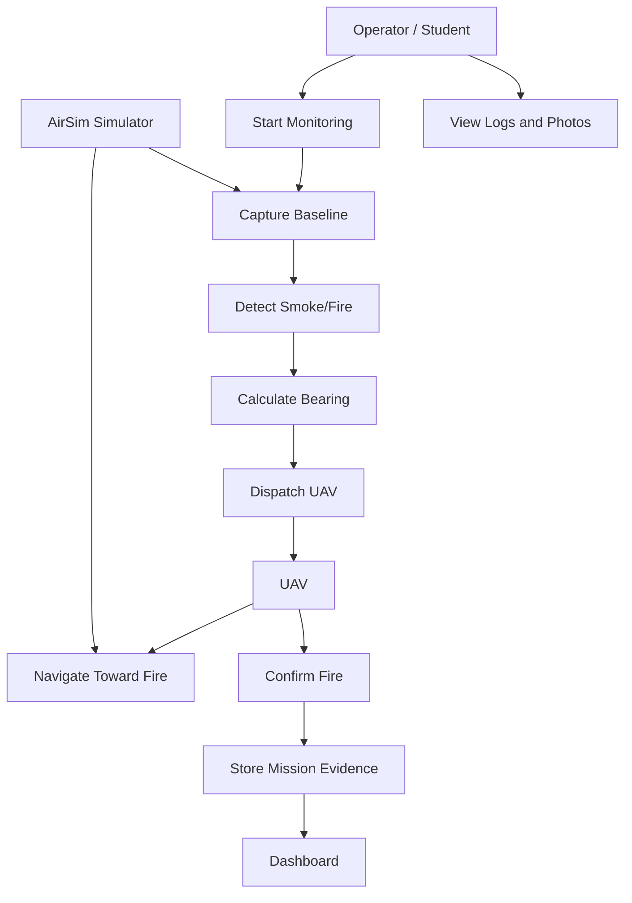

Main use cases:

1. Start monitoring.
2. Capture baseline frame.
3. Detect smoke/fire.
4. Calculate bearing.
5. Dispatch UAV.
6. Navigate toward suspected fire.
7. Confirm fire.
8. View dashboard.
9. Store mission evidence.

### 6.3 Sequence Diagrams

The sequence of interactions between system components for a specific scenario is explained using sequence diagrams.

The first sequence shows the alarm and dispatch process. The important point is that the tower produces a bearing, not a complete path. This supports the design decision to use bearing navigation first.

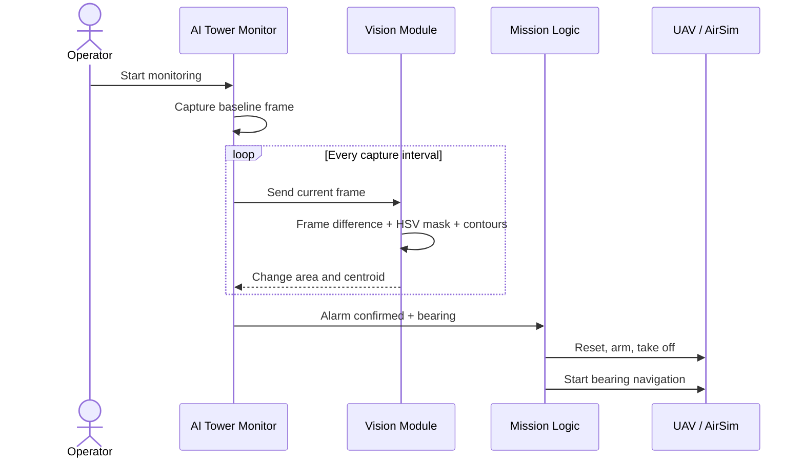

The second sequence shows the close-range confirmation process. After the bearing phase detects enough smoke or reaches a handoff condition, the PPO environment and UAV camera support final confirmation.

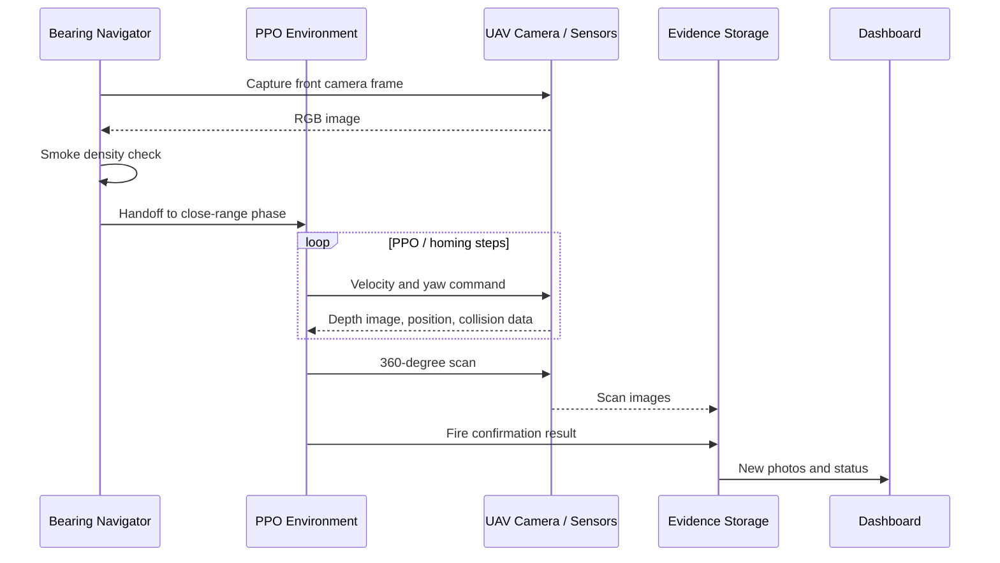

The third sequence shows the bearing navigation phase in more detail. This phase is important because the system does not initially know the exact fire coordinates. The UAV therefore follows a suspected direction and uses camera evidence to decide when to hand off to the close-range phase.

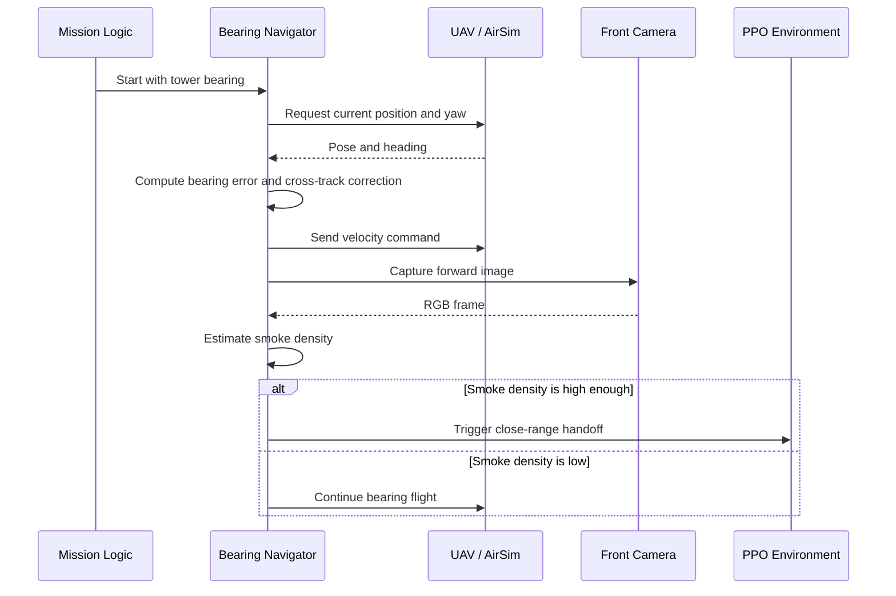

The fourth sequence shows one step of the PPO-based local navigation loop. This diagram explains why a learning-based component is useful in the project: the UAV must react to nearby trees and partial sensor information instead of following a precomputed complete path.

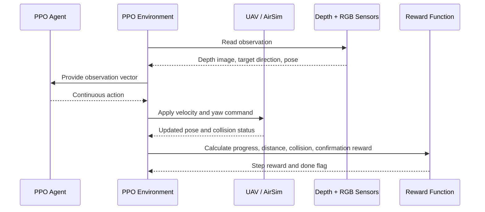

The fifth sequence shows how the dashboard receives mission information. This is useful for the report because it separates the autonomous mission logic from the monitoring interface.

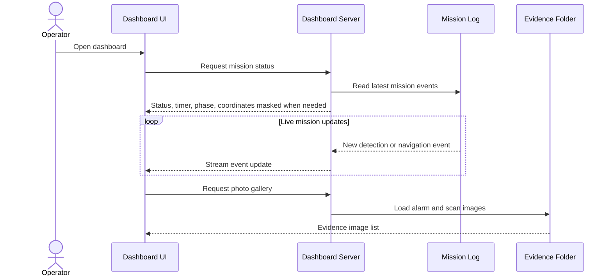

The sixth sequence shows failure handling and safe mission termination. Even in simulation, this scenario should be modeled because real autonomous UAV systems must explain what happens when detection is weak, the UAV collides, or the mission cannot be confirmed.

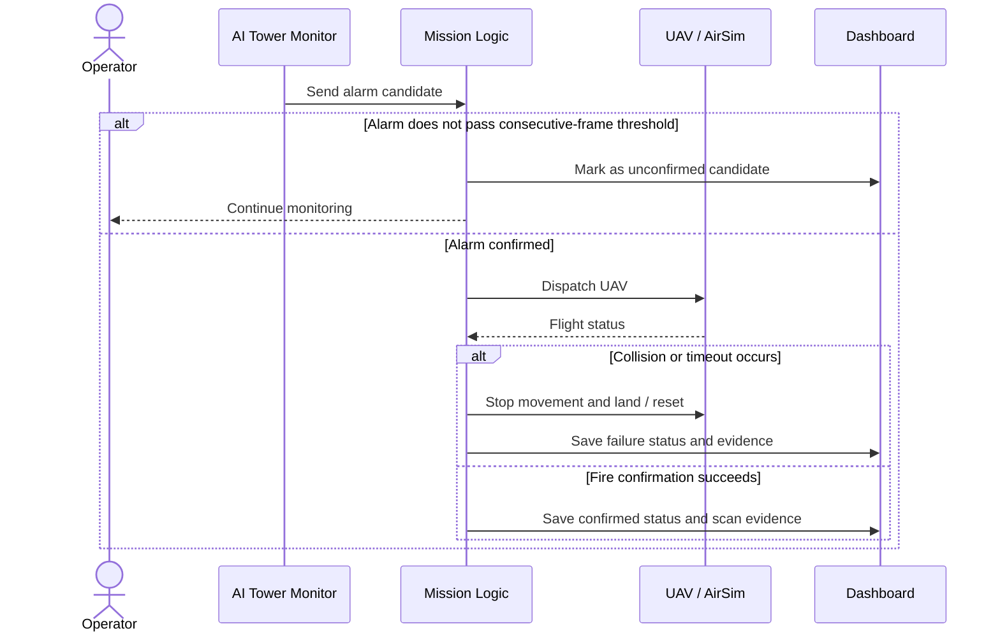

### 6.4 Class Diagrams

The classes in the system, their attributes, methods, and relationships are modeled using class diagrams.

The class diagram summarizes the main implementation units visible in the repository. The actual project is implemented as Python modules rather than a strict object-oriented enterprise system, but the classes and modules still have clear responsibilities.

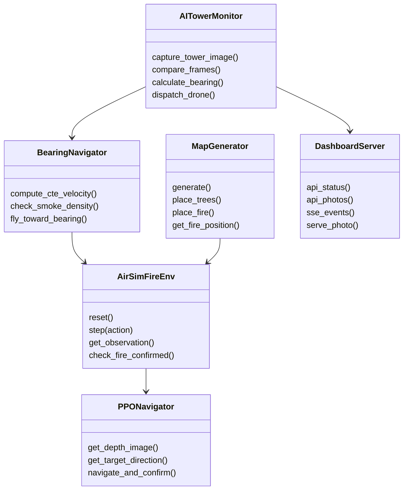

### 6.5 Data Design & ER Diagram

This section provides the Entity-Relationship diagram and a data dictionary (data types, constraints).

The current system mainly stores data as files rather than in a relational database. However, the logical data model can still be represented using an ER diagram. This is useful because future versions may store mission records in SQLite or another database.

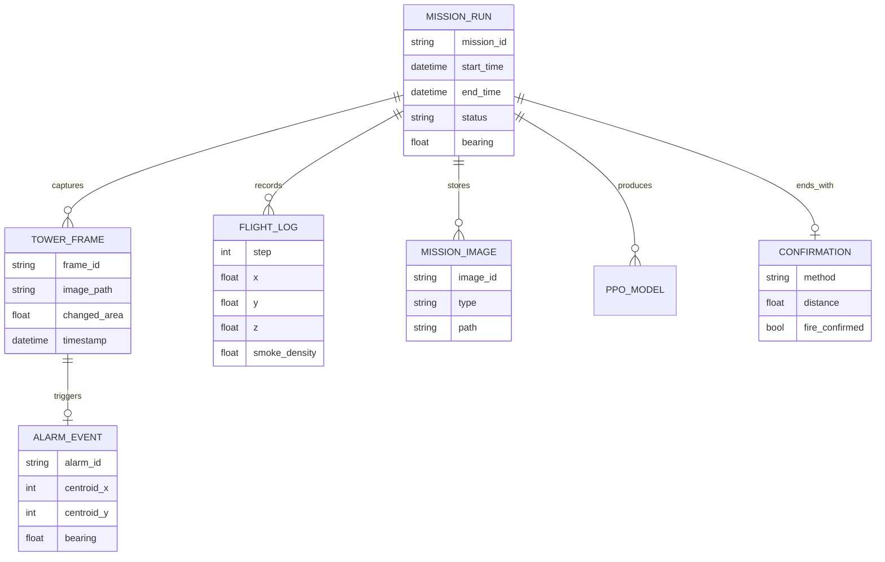

Important data artifacts:

| Data Artifact | Current Storage | Purpose |
|---|---|---|
| Baseline frame | autonomousflight/output/BASELINE_*.png | Clear reference image |
| Monitor frame | autonomousflight/output/MONITOR_*.png | Tower monitoring history |
| Alarm image | autonomousflight/output/ALARM_*_ANNOTATED_*.png | Evidence for detection and bearing |
| Bearing frame | autonomousflight/output/bearing_nav/*.png | Drone view during approach |
| Scan images | autonomousflight/output/mission/scan_*.png | Fire confirmation evidence |
| Dashboard log | autonomousflight/output/dashboard.log | Mission timeline and events |
| PPO model | autonomousflight/models/ppo_forest_final.zip | Learned policy output |
| Mission report JSON | autonomousflight/output/mission/mission_report_*.json | Structured mission result when generated |

## 7. Implementation and Screenshots

In this section, important code blocks and visual evidence of the project's current state are provided. The screenshots are explained in detail to demonstrate the implemented features.

The project is implemented mainly in Python, HTML, CSS, and JavaScript. The UAV and sensor interaction happens through AirSim APIs [8]. Image processing is done with OpenCV [12]. The reinforcement learning part uses PPO [9], Stable-Baselines3 [10], PyTorch [20], and a Gymnasium-style environment [11].

### 7.1 Tower Detection Implementation

The tower module captures a baseline frame, captures later frames, computes grayscale frame difference, applies HSV smoke/fire masks, removes exclusion zones, finds contours, and calculates the centroid of the largest region. The centroid is then converted into a bearing using camera FOV and tower yaw.

Actual recorded output:

Figure 1. Actual tower alarm image from the recorded mission. It shows the detected region, centroid, bearing, and changed area.

### 7.2 Drone Flight Screenshot Placeholder

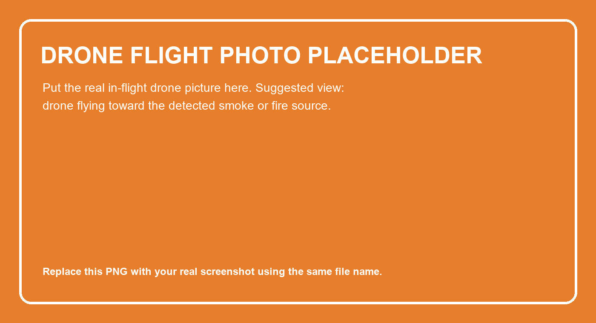

Figure 2. Placeholder for drone flying toward the fire.

Photo prompt: Drone flying toward a visible smoke plume or fire source over forest terrain during Phase A bearing navigation.

### 7.3 Dashboard Screenshot Placeholder

Figure 3. Placeholder for dashboard screenshot.

Photo prompt: Dashboard showing mission status, live console logs, mission timer, Sector C map, and photo gallery after fire confirmation.

### 7.4 Close-Range Confirmation Screenshots

The mission phase captured five scan images near the fire. In the recorded run, fire-colored pixels were detected in all scan directions.

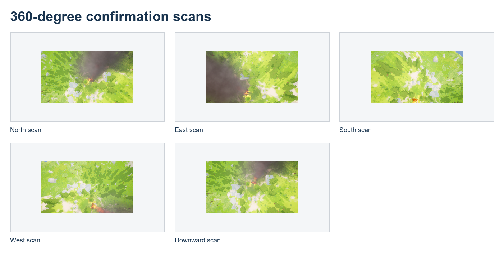

Figure 4. Actual confirmation scan images from the mission output.

| Scan Direction | Fire-Colored Pixels |
|---|---:|
| North | 3,801 |
| East | 5,803 |
| South | 7,086 |
| West | 2,913 |
| Downward | 5,756 |

### 7.5 Implementation Summary

| Module / File | Implementation Role |
|---|---|
| autonomousflight/scripts/ai_tower_monitor.py | Tower monitoring, alarm logic, bearing calculation, mission dispatch |
| autonomousflight/scripts/bearing_navigator.py | Phase A bearing navigation, cross-track correction, smoke density handoff |
| autonomousflight/scripts/ppo_environment.py | Custom Gymnasium-style AirSim environment for PPO training/control |
| autonomousflight/scripts/ppo_navigator.py | PPO inference mode for trained model navigation |
| autonomousflight/scripts/map_generator.py | Seed-based placement of trees and fire actor in the AirSim scene |
| autonomousflight/scripts/test_map_generator.py | Verification tests for actors, seeds, distance, and bounds |
| Dashboard/dashboard_server.py | Local web server, status API, photo API, server-sent events, log watcher |
| Dashboard/dashboard.js | Dashboard state machine, console log display, photo gallery, mission status |

### 7.6 Additional Evidence That Can Strengthen the Report

The report can be made stronger by adding more direct visual and numerical evidence from the project. These additions are optional, but they would make the project easier to defend because they show not only the final result, but also the reasoning, limitations, and validation process.

| Additional Material | Why It Helps | What to Add |
|---|---|---|
| Real dashboard screenshot | Shows that the system is not only an algorithm, but also has a monitoring interface | Replace the pink dashboard placeholder with your actual dashboard image |
| Real drone flying toward fire screenshot/photo | Makes the autonomous mission visually understandable | Replace the orange drone placeholder with your AirSim or real drone flight image |
| Top-down flight trajectory | Shows the path from dispatch to confirmation | Add a map-style image with tower location, initial UAV position, bearing line, handoff point, and confirmation point |
| Parameter sensitivity table | Explains why threshold, minimum area, and consecutive-frame settings were selected | Compare detection threshold, minimum contour area, false alarms, and missed detections |
| Ablation comparison | Defends the hybrid approach | Compare rule-only, PPO-only, and hybrid navigation in one table |
| Failure case screenshots | Shows engineering honesty and robustness | Add examples such as weak smoke, wrong bearing, collision, timeout, or no-fire scenario |
| Detection validation table | Supports the result discussion with measurable evidence | Include fire/no-fire test cases, alarm status, bearing output, handoff status, and confirmation result |
| Reward curve or training summary | Supports the PPO implementation | Add training reward graph, collision rate, success rate, or final checkpoint summary |
| Real-world deployment sketch | Shows future applicability | Add a diagram showing camera tower, UAV, base station, operator, and emergency-response handoff |

Recommended photo prompts/placeholders:

- **Top-down trajectory placeholder:** "Top-down technical map of a forest fire UAV mission, fixed watchtower, drone start point, bearing line, handoff point, and final fire confirmation point, clean engineering report style."
- **Failure case placeholder:** "Simulation screenshot of an autonomous drone in a dense forest mission encountering an obstacle or weak smoke signal, technical report placeholder style."
- **Real-world deployment placeholder:** "Engineering diagram style image showing a forest watchtower camera detecting smoke and dispatching a quadcopter drone toward a small forest fire, with an operator dashboard nearby."

## 8. Project Management and Planning

This section provides a detailed timeline of the development phases across the eight-month project period (October 2025 – May 2026), a sprint-level work breakdown, a visual Gantt schedule, milestone tracking, and a risk analysis with actual outcomes.

The project was developed in an iterative, Agile-inspired engineering style [18]. Each sprint targeted one or two functional modules, which were integrated and tested before the next sprint began. This iterative approach was especially appropriate because simulation, perception, navigation, and dashboard modules each had independent failure modes and required repeated adjustment cycles. Project planning followed established project management ideas such as dividing work into deliverables, identifying risks early, and validating outputs progressively [17].

### 8.1 Work Breakdown Structure (WBS)

The total development effort was divided into eight major phases, each with a set of concrete deliverables. The table below maps each phase to its calendar period, the work packages executed, and the evidence output produced.

| Phase | Period | Work Package | Deliverable / Output |
|---|---|---|---|
| Phase 0 | Oct 2025 | Problem scoping, CENG400 design proposal, literature survey | Research notes, academic references, initial architecture sketch |
| Phase 1 | Oct–Nov 2025 | AirSim + Unreal Engine integration, sensor configuration, physics validation | Working multirotor in forest scene with RGB camera, depth camera, and IMU |
| Phase 2 | Nov–Dec 2025 | Tower camera module: baseline capture, frame differencing, HSV fire/smoke masking, contour detection, bearing formula | `ai_tower_monitor.py`, annotated alarm images, bearing output in logs |
| Phase 3 | Dec 2025–Jan 2026 | Bearing navigator: cross-track correction, altitude hold, smoke density monitoring, phase-handoff logic | `bearing_navigator.py`, flight frame snapshots, handoff trigger logs |
| Phase 4 | Jan–Feb 2026 | PPO environment design: Gymnasium-style API, depth observation, target-direction vector, reward shaping, collision handling | `ppo_environment.py`, initial training runs, reward curve plots |
| Phase 5 | Feb–Mar 2026 | PPO training and tuning: hyperparameter search, reward rate adjustment, altitude descent parameters, PPO checkpoint management | `train_ppo.py`, trained policy `ppo_forest_final.zip`, survival rate metrics |
| Phase 6 | Mar–Apr 2026 | Fire confirmation module: 360-degree scan, HSV fire pixel counting, confirmation event logging, scan image saving | Scan images, confirmation distance measurement (4.3 m in recorded run) |
| Phase 7 | Apr 2026 | Map generator: seed-based tree/fire actor placement, bounds validation, minimum-distance enforcement; connection and flight tests | `map_generator.py`, `test_map_generator.py`, repeatability verification |
| Phase 8 | Apr–May 2026 | Dashboard development: Flask-style server, Server-Sent Events log streaming, photo gallery, mission status API, mission timer | `dashboard_server.py`, `dashboard.js`, `index.html`, `index.css` |
| Phase 9 | May 2026 | End-to-end integration test, mission recording, privacy masking for coordinates in dashboard console, final evidence collection | Recorded mission run, alarm images, scan contact sheet, dashboard log |
| Phase 10 | May 2026 | Report writing, UML diagrams, reference consolidation, CENG401 submission | `CENG401_Detailed_Project_Report.md`, final defense preparation |

### 8.2 Gantt Schedule

The following Gantt chart summarizes the high-level schedule across the eight-month development window.

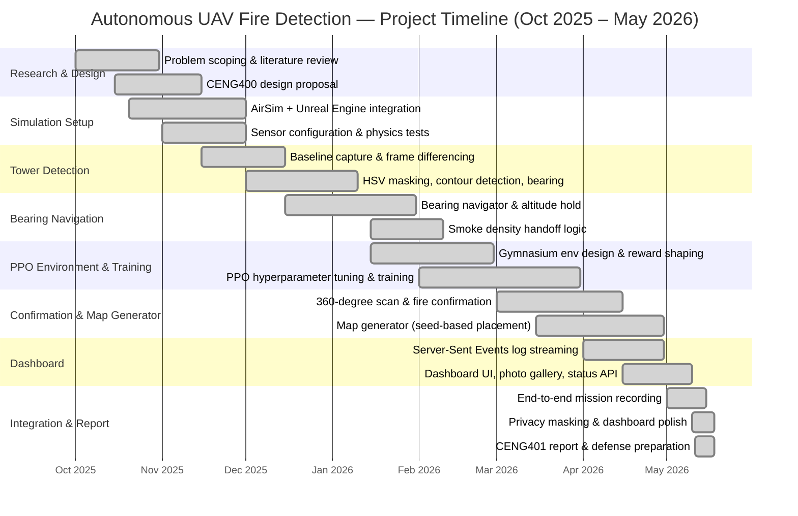

### 8.3 Key Milestones

| # | Milestone | Target Date | Status |
|---|---|---|---|
| M1 | AirSim multirotor flyable in Unreal forest scene | Nov 2025 | ✅ Achieved |
| M2 | Tower alarm image generated with bearing angle | Dec 2025 | ✅ Achieved |
| M3 | UAV follows bearing ray and saves flight frames | Jan 2026 | ✅ Achieved |
| M4 | Smoke density handoff triggers PPO phase | Feb 2026 | ✅ Achieved |
| M5 | PPO agent trained and able to avoid trees | Mar 2026 | ✅ Achieved |
| M6 | 360-degree scan confirms fire at close range | Apr 2026 | ✅ Achieved |
| M7 | Seed-based map generator with test suite | Apr 2026 | ✅ Achieved |
| M8 | Dashboard live-streams logs and photo gallery | May 2026 | ✅ Achieved |
| M9 | Full end-to-end mission recorded and validated | May 2026 | ✅ Achieved |
| M10 | Final report submitted and defense ready | May 2026 | ✅ Achieved |

### 8.4 Sprint Summary

Each sprint lasted approximately two to four weeks and targeted specific modules. The table below summarizes the sprint outputs.

| Sprint | Approx. Period | Focus Area | Key Outcome |
|---|---|---|---|
| S1 | Oct 2025 | Research & scoping | Architecture decision: AI Tower + Bearing + PPO hybrid |
| S2 | Nov 2025 | Simulation foundation | AirSim multirotor with sensors operational in UE forest |
| S3 | Dec 2025 | Tower detection | `ai_tower_monitor.py` producing annotated alarm images |
| S4 | Jan 2026 | Bearing navigation | `bearing_navigator.py` tracking bearing ray with cross-track correction |
| S5 | Feb 2026 | PPO environment | `ppo_environment.py` with depth obs., target direction, reward function |
| S6 | Mar 2026 | PPO training | Reward rate tuning; altitude descent parameters (DESCENT_FLOOR_Z=65) stabilized |
| S7 | Apr 2026 | Confirmation & map | 360-degree scan, `map_generator.py`, `test_map_generator.py` |
| S8 | Apr–May 2026 | Dashboard | Full dashboard with SSE streaming, mission timer, photo gallery |
| S9 | May 2026 | Integration & polish | End-to-end mission run; coordinate privacy masking; report writing |

### 8.5 Risk Management

The following risks were identified at project start and tracked throughout development. The "Actual Outcome" column documents what happened in practice.

| Risk | Likelihood | Impact | Mitigation Plan | Actual Outcome |
|---|---|---|---|---|
| False alarm from lighting or water reflection | Medium | High | HSV filtering, contour area threshold, exclusion zones, consecutive detection requirement | Mitigated: multi-frame confirmation and HSV tuning reduced false positives |
| UAV collision with terrain or trees | High | High | Controlled cruising altitude, depth observation, collision checks in PPO environment | Partially mitigated: altitude hold (DESCENT_FLOOR_Z=65) stabilized flight; depth obs. guards trees |
| PPO overfitting to one scenario | Medium | Medium | Seed-based randomized maps, multiple fire positions planned | Partially mitigated: map generator with seeds added; broader randomization is future work |
| AirSim API instability or simulator crash | Medium | High | Staged testing, reset logic, try/except wrappers, mission logs | Mitigated: reset and reconnect logic implemented; staged module testing reduced failures |
| No exact fire coordinate at mission start | Certain | Low (by design) | Use bearing navigation first; confirm at close range | By design: bearing navigation fully resolved this constraint |
| PPO training time too long | Medium | Medium | Reward shaping to converge faster; reduce unnecessary exploration | Mitigated: reward rate adjustment commit (2026-05-10) improved convergence speed |
| Dashboard performance with live log streaming | Low | Medium | Server-Sent Events (SSE) instead of polling; batched log updates | Mitigated: SSE-based log streaming implemented with low overhead |
| Report evidence missing or incomplete | Low | High | Save alarm images, scan images, dashboard logs, mission JSON, scan contact sheet | Mitigated: structured output folder with all evidence artifacts saved automatically |

## 9. Test Strategy and Validation

This section defines how requirements will be verified. It includes Test Cases (inputs vs. expected outputs) and outlines the strategy for Unit Testing, Integration Testing, and User Acceptance Testing.

Testing was designed at multiple levels: component tests, integration tests, and mission validation. This is important because autonomous systems can fail even if individual modules appear to work separately.

### 9.1 Component Tests

| Test Area | Test Description | Evidence / Expected Result |
|---|---|---|
| AirSim connection | Confirm simulator API responds | Connection message in log |
| Tower image capture | Capture baseline and monitoring images | PNG images saved in output folder |
| Frame comparison | Detect changed smoke/fire-like area | Mask and annotated alarm image |
| Bearing formula | Convert centroid to bearing | Bearing value in dashboard log |
| Map generator | Verify actors, seed repeatability, bounds, minimum tree distance | test_map_generator.py output |
| Dashboard server | Serve status, photos, and SSE logs | Browser dashboard updates |

### 9.2 Integration Validation

The recorded mission demonstrates an end-to-end scenario:

| Metric | Recorded Value | Validation Meaning |
|---|---:|---|
| Tower image resolution | 1920 x 1080 | Sufficient for visual localization |
| Monitoring interval | 5 s | Periodic tower monitoring worked |
| First detection hit | 3,921.5 changed pixels | Smoke/fire change exceeded threshold |
| Confirmed alarm area | 50,742 changed pixels | Strong detection evidence |
| Calculated bearing | 207.38 degrees | Bearing passed to UAV dispatch |
| Fire actor position | (-238.20, 24.20) m | Simulation target location detected |
| Smoke density at handoff | 20.09 percent | Handoff threshold exceeded |
| Fire confirmation distance | 4.3 m | Close-range scan confirmed fire |
| Alarm-to-landing duration | about 5 min 46 s | Full response sequence completed |

### 9.3 Validation Limitations

The current validation is mainly a proof-of-concept mission. It shows that the pipeline can work, but it does not prove field reliability. A stronger validation plan would repeat the test across many random seeds, fire locations, tree densities, lighting conditions, and smoke intensities. Future evaluation should measure false alarm rate, missed detection rate, bearing error, collision rate, average mission time, and success rate across many trials.

## 10. Social, Economic, and Ethical Impact

This section discusses the cost analysis and sustainability of the project, as well as its ethical implications.

The social value of the project is early wildfire awareness. Wildfires can damage ecosystems, homes, infrastructure, and human health [1]. A system that detects fire earlier and sends a UAV for confirmation could help emergency teams respond faster.

The economic impact could also be positive. Faster confirmation may reduce unnecessary human patrols and may help emergency teams allocate resources earlier. However, a real-world system would require investment in UAV hardware, maintenance, batteries, communication infrastructure, operator training, and legal compliance.

The ethical impact must be considered carefully. UAVs can capture images from the air, so privacy must be protected. The system should avoid collecting unnecessary human data, should not fly over restricted areas without permission, and should keep a human operator in the loop for real emergency decisions. These points are consistent with professional computing ethics, including public safety, privacy, and responsible system deployment [19].

Safety is also an ethical issue. A real UAV should include geofencing, emergency landing, communication-loss behavior, obstacle avoidance, and regulatory compliance. The current system is simulation-only, so it should not be presented as ready for real deployment without additional safety engineering.

## 11. Technologies

This section explains the technology stack planned to be used in the project (programming languages, frameworks, libraries, databases, etc.). In addition, the overall system architecture is presented using an architectural diagram or schema.

The proposed system is developed and evaluated within a simulation-based framework using a combination of modern game engines, machine learning libraries, and data processing tools. Unreal Engine is employed to generate a realistic forest environment, enabling high-fidelity visual rendering and complex under-canopy scenarios. Microsoft AirSim is integrated with Unreal Engine to simulate drone dynamics, physics-based motion, and onboard sensor data, including RGB and depth cameras.

Python is used as the primary programming language due to its extensive ecosystem for artificial intelligence and robotics research. Deep Reinforcement Learning models are implemented using PyTorch, while the Proximal Policy Optimization (PPO) algorithm is realized through the Stable-Baselines3 framework, providing a reliable and efficient reinforcement learning pipeline. For fire and smoke detection, OpenCV is utilized to perform real-time image processing and color-based anomaly detection on RGB camera data.

| Technology | Use in Project | Reference |
|---|---|---|
| AirSim | Multirotor simulation, camera streams, movement commands, collision information | [8] |
| Unreal Engine scene | Forest terrain, trees, fire/smoke actor, fixed tower viewpoint | [8] |
| Python | Main implementation language for simulation, vision, and RL modules | Project implementation |
| OpenCV | Frame differencing, HSV filtering, contour detection, annotated images | [12] |
| NumPy | Image array operations and vector math | [21] |
| Gymnasium | Environment API for reset, step, observation, action, reward | [11] |
| Stable-Baselines3 | PPO implementation and reinforcement learning utilities | [10] |
| PyTorch | Neural network backend used by RL stack | [20] |
| HTML/CSS/JavaScript | Dashboard interface and client-side state visualization | Project implementation |
| Server-Sent Events | Streaming dashboard log updates | Project implementation |

## 12. Conclusion

This report summarizes the scope, objectives, justification, and technical approach of the term project and is intended to serve as a guiding reference for the subsequent stages of the study.

This project demonstrates an autonomous UAV simulation pipeline for early fire detection and confirmation. The system starts with incomplete information, which is realistic for early fire detection. The tower camera provides a bearing rather than a full map or exact fire coordinate. The UAV then approaches the suspected region and confirms the fire from close range. This explains why the project uses a hybrid approach: rule-based methods are used for structured and explainable tasks such as image differencing, HSV filtering, thresholding, and bearing calculation, while PPO-based navigation is used for the more uncertain close-range phase.

The recorded mission provides concrete evidence that the integrated pipeline works in simulation. The tower detected a large smoke/fire change region, calculated a bearing, dispatched the drone, handed off after smoke detection, captured close-range scans, confirmed the fire, and completed the mission. The project is not a final real-world wildfire response product, but it is a strong simulation prototype. Future work should focus on larger test sets, deep learning fire/smoke detection, improved obstacle-aware navigation, more realistic environmental conditions, and real UAV safety planning.

Overall, the strongest outcome of this study is not only that the UAV can reach and confirm a simulated fire, but that the project connects detection, navigation, confirmation, evidence collection, and operator visualization into one coherent workflow. This makes the project valuable as an engineering prototype: every stage produces observable evidence, and each design choice can be justified by the uncertainty of early fire detection. With additional testing, stronger datasets, and real-world safety constraints, the same architecture could be extended toward practical decision-support systems for wildfire monitoring.

## References

[1] United Nations Environment Programme and GRID-Arendal. (2022). Spreading like Wildfire: The Rising Threat of Extraordinary Landscape Fires. https://wedocs.unep.org/handle/20.500.11822/38372

[2] Alkhatib, A. A. A. (2014). A Review on Forest Fire Detection Techniques. International Journal of Distributed Sensor Networks, 2014, Article ID 597368. https://doi.org/10.1155/2014/597368

[3] Barmpoutis, P., Papaioannou, P., Dimitropoulos, K., & Grammalidis, N. (2020). A Review on Early Forest Fire Detection Systems Using Optical Remote Sensing. Sensors, 20(22), 6442. https://doi.org/10.3390/s20226442

[4] Chaturvedi, S., Khanna, P., & Ojha, A. (2022). A survey on vision-based outdoor smoke detection techniques for environmental safety. ISPRS Journal of Photogrammetry and Remote Sensing, 185, 158-187. https://doi.org/10.1016/j.isprsjprs.2022.01.013

[5] Yuan, C., Zhang, Y., & Liu, Z. (2015). A survey on technologies for automatic forest fire monitoring, detection, and fighting using unmanned aerial vehicles and remote sensing techniques. Canadian Journal of Forest Research, 45(7), 783-792. https://doi.org/10.1139/cjfr-2014-0347

[6] Bouguettaya, A., Zarzour, H., Taberkit, A. M., & Kechida, A. (2022). A review on early wildfire detection from unmanned aerial vehicles using deep learning-based computer vision algorithms. Signal Processing, 190, 108309. https://doi.org/10.1016/j.sigpro.2021.108309

[7] Tzoumas, G., Pitonakova, L., Salinas, L., Scales, C., Richardson, T., Arvin, F., & Hauert, S. (2023). Wildfire detection in large-scale environments using force-based control for swarms of UAVs. Swarm Intelligence, 17, 89-115. https://doi.org/10.1007/s11721-022-00218-9

[8] Shah, S., Dey, D., Lovett, C., & Kapoor, A. (2017). AirSim: High-Fidelity Visual and Physical Simulation for Autonomous Vehicles. Field and Service Robotics, 621-635. https://doi.org/10.1007/978-3-319-67361-5_40

[9] Schulman, J., Wolski, F., Dhariwal, P., Radford, A., & Klimov, O. (2017). Proximal Policy Optimization Algorithms. arXiv:1707.06347. https://doi.org/10.48550/arXiv.1707.06347

[10] Raffin, A., Hill, A., Gleave, A., Kanervisto, A., Ernestus, M., & Dormann, N. (2021). Stable-Baselines3: Reliable Reinforcement Learning Implementations. Journal of Machine Learning Research, 22(268), 1-8. https://jmlr.org/papers/v22/20-1364.html

[11] Towers, M., Kwiatkowski, A., Terry, J., Balis, J. U., De Cola, G., Deleu, T., Goulao, M., Kallinteris, A., Krimmel, M., KG, A., et al. (2024). Gymnasium: A Standard Interface for Reinforcement Learning Environments. arXiv:2407.17032. https://arxiv.org/abs/2407.17032

[12] Bradski, G. (2000). The OpenCV Library. Dr. Dobb's Journal of Software Tools. OpenCV project information: https://opencv.org/about/

[13] ISO/IEC/IEEE. (2018). ISO/IEC/IEEE 29148:2018 Systems and software engineering - Life cycle processes - Requirements engineering. https://www.iso.org/standard/72089.html

[14] ISO/IEC/IEEE. (2022). ISO/IEC/IEEE 42010:2022 Software, systems and enterprise - Architecture description. https://www.iso.org/standard/74393.html

[15] ISO/IEC. (2023). ISO/IEC 25010:2023 Systems and software engineering - Systems and software Quality Requirements and Evaluation (SQuaRE) - Product quality model. https://www.iso.org/standard/78176.html

[16] Object Management Group. (2017). OMG Unified Modeling Language Version 2.5.1. https://www.omg.org/spec/UML/2.5.1/

[17] Project Management Institute. (2021). A Guide to the Project Management Body of Knowledge (PMBOK Guide), Seventh Edition. https://www.pmi.org/pmbok-guide-standards/foundational/pmbok

[18] Schwaber, K., & Sutherland, J. (2020). The Scrum Guide. https://scrumguides.org/scrum-guide.html

[19] Association for Computing Machinery. (2018). ACM Code of Ethics and Professional Conduct. https://www.acm.org/code-of-ethics

[20] Paszke, A., Gross, S., Massa, F., Lerer, A., Bradbury, J., Chanan, G., Killeen, T., Lin, Z., Gimelshein, N., Antiga, L., et al. (2019). PyTorch: An Imperative Style, High-Performance Deep Learning Library. Advances in Neural Information Processing Systems 32. https://papers.neurips.cc/paper/2019/hash/bdbca288fee7f92f2bfa9f7012727740-Abstract.html

[21] Harris, C. R., Millman, K. J., van der Walt, S. J., Gommers, R., Virtanen, P., Cournapeau, D., Wieser, E., Taylor, J., Berg, S., Smith, N. J., et al. (2020). Array programming with NumPy. Nature, 585, 357-362. https://doi.org/10.1038/s41586-020-2649-2

[22] Yuan, C., Liu, Z., & Zhang, Y. (2015). UAV-based forest fire detection and tracking using image processing techniques. In 2015 International Conference on Unmanned Aircraft Systems (ICUAS) (pp. 639-643). IEEE. https://doi.org/10.1109/ICUAS.2015.7152345

[23] Akhloufi, M. A., Couturier, A., & Castro, N. A. (2021). Unmanned Aerial Vehicles for Wildland Fires: Sensing, Perception, Cooperation and Assistance. Drones, 5(1), 15. https://doi.org/10.3390/drones5010015

[24] Zhang, J., Li, W., Han, Z., Liu, J., Zhao, L., & Dong, F. (2020). Forest fire detection system based on a deep learning algorithm and UAVs. Infrared Physics & Technology, 111, 103554. https://doi.org/10.1016/j.infrared.2020.103554

[25] Giglio, L., Schroeder, W., & Justice, C. O. (2016). The collection 6 MODIS active fire detection algorithm and fire products. Remote Sensing of Environment, 178, 31-41. https://doi.org/10.1016/j.rse.2016.02.054

[26] Toreyin, B. U., Dedeoglu, Y., Gudukbay, U., & Cetin, A. E. (2006). Computer vision based method for real-time fire and flame detection. Pattern Recognition Letters, 27(1), 49-58. https://doi.org/10.1016/j.patrec.2005.06.015

[27] Celik, T., & Demirel, H. (2009). Fire detection in video sequences using a generic color model. Fire Safety Journal, 44(2), 147-158. https://doi.org/10.1016/j.firesaf.2008.05.005

[28] Foggia, P., Saggese, A., & Vento, M. (2015). Real-time fire detection for video-surveillance applications using a combination of experts based on color, shape, and motion. IEEE Transactions on Circuits and Systems for Video Technology, 25(9), 1545-1556. https://doi.org/10.1109/TCSVT.2015.2392531

[29] Hart, P. E., Nilsson, N. J., & Raphael, B. (1968). A formal basis for the heuristic determination of minimum cost paths. IEEE Transactions on Systems Science and Cybernetics, 4(2), 100-107. https://doi.org/10.1109/TSSC.1968.300136

[30] LaValle, S. M. (1998). Rapidly-exploring random trees: A new tool for path planning. Technical Report TR 98-11, Iowa State University. https://lavalle.pl/papers/Lav98c.pdf

[31] Kavraki, L. E., Svestka, P., Latombe, J.-C., & Overmars, M. H. (1996). Probabilistic roadmaps for path planning in high-dimensional configuration spaces. IEEE Transactions on Robotics and Automation, 12(4), 566-580. https://doi.org/10.1109/70.508439
